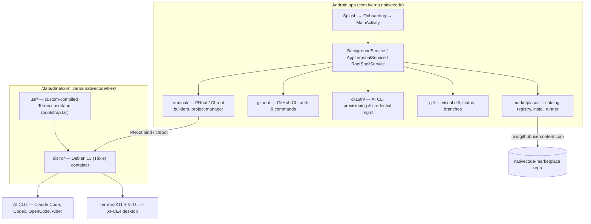

<p align="center">
  
</p>

<h1 align="center">NativeCode</h1>

<p align="center">
  <strong>Portable Linux &amp; AI Developer Environment</strong><br>
  Run a full Debian Linux desktop and AI coding agents on Android.
</p>

<p align="center">
  
  
  
  
</p>

<p align="center">
  <a href="https://github.com/abhay-byte/nativecode-ai"></a>
  <a href="https://github.com/abhay-byte/nativecode-marketplace"></a>
</p>

NativeCode transforms a phone or tablet into a portable Linux workstation — a Debian 13 (Trixie) container with a graphical XFCE4 desktop, preconfigured development runtimes, and terminal-first AI coding tools. No PC required.

---

## Features

- **Debian 13 (Trixie) Linux container** — native glibc userland with `apt`, package management, and a full Linux environment.
- **Two isolation modes** — user-space **PRoot** (no root required) and kernel-space **Chroot** (for rooted devices).
- **XFCE4 desktop GUI** — integrated Termux-X11 display server with VirGL GPU acceleration.
- **AI CLI engine** — run Claude Code, Codex, OpenCode, Aider, and more inside the native terminal.
- **Preconfigured runtimes** — Node.js 26 LTS, Python 3.12, GCC, and standard package managers.
- **Git workspace** — multi-repo project tree, real-time status, visual diff inspector, and branch switching, plus GitHub CLI integration.
- **Software marketplace** — browse and install packages from an in-app catalog sourced from [nativecode-marketplace](https://github.com/abhay-byte/nativecode-marketplace).
- **CLI provisioning** — guided install and credential management for AI vendor tools.
- **Cyber-brutalist UI** — obsidian theme with glassmorphism cards and a sharp, high-contrast design.

## Getting Started

### Requirements

- Android 8.0+ (SDK 26+), built against SDK 36.
- At least **10 GB** free internal storage (hard requirement).
- Recommended: 7 GB+ RAM and a modern SoC (Snapdragon 8 Gen 2 / Dimensity 9200 / Tensor G3 / Exynos 2200 or newer).

### First Launch

On first run, the onboarding wizard guides you through setup:

1. **Privacy & consent** — review and accept the setup plan.
2. **Intro** — brand overview and capabilities.
3. **Slideshow** — workspace, AI tools, runtimes, XFCE desktop, Debian container, Git.
4. **Device check** — verifies storage, RAM, and swap against requirements.
5. **Isolation mode** — choose **PRoot** (recommended) or **Chroot**.
6. **Install plan** — review packages and consent before installation.
7. **Base setup** — extracts the bootstrap and provisions the Debian container with live progress and console output.
8. **Complete** — environment summary and launch.

## Screenshots

<p align="center">
  
  
  
  
</p>

<p align="center">
  
  
</p>

## Architecture



The app ships a custom `bootstrap.tar` — a Termux userland compiled against the app's private package namespace — and copies it to internal storage on first launch. A PRoot bind mount maps the custom prefix to `/data/data/com.termux`, letting standard tooling run unmodified inside the sandbox. SSL certificates are exposed via `SSL_CERT_FILE` / `CURL_CA_BUNDLE`.

## Building

```bash
./gradlew assembleRelease
# APK: app/build/outputs/apk/release/app-release.apk
```

Install on a connected device:

```bash
adb install -r app/build/outputs/apk/release/app-release.apk
```

## Repository Layout

```
app/            Android application (Kotlin, Android Views, no Compose)
termux-x11/     Bundled Termux-X11 display server (patched)
stub/           Stub module
termux-app/     Termux reference (subtree)
bootstrap.tar   Compiled custom Termux userland archive
docs/           Architecture, plans, environment regression suite, Play Store policy
fastlane/       Store metadata
```

## Documentation

- `docs/README.md` — container architecture and setup internals
- `docs/environment/` — environment regression suite and command reference
- `docs/plan/` — feature and UX plans
- `docs/project/` — design specs (onboarding, UI/UX, AI CLI catalog)
- `docs/policy/` — Google Play Store compliance

## Roadmap

- Chroot mode polish (kernel-space execution on rooted devices)
- Deeper marketplace catalog (GPU compute, emulation, tooling)
- Expanded AI harness support and model management

## License

Proprietary. See `docs/privacy-policy.md` for privacy details.
